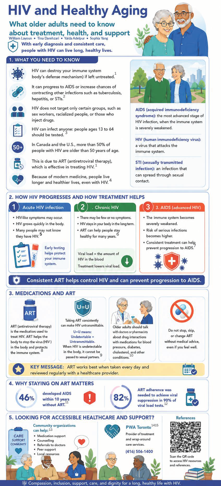
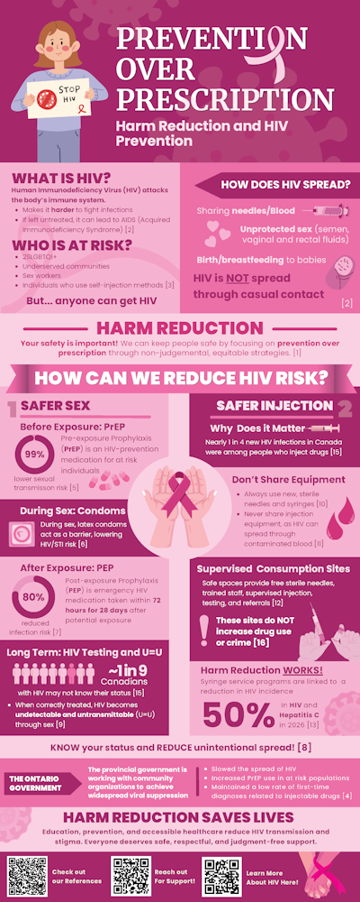
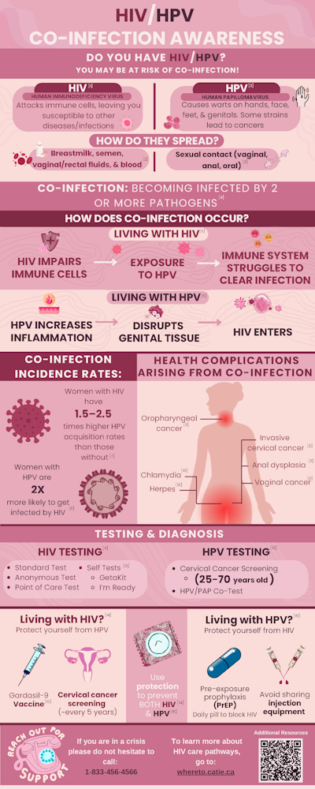
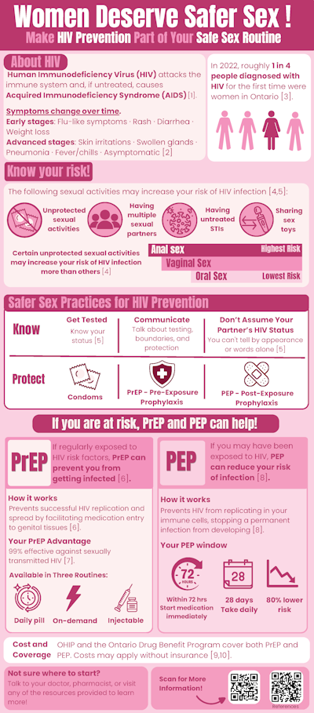

## Introduction

This is a collaboration between the Map & Data Library and Dr. Haley Zubyk to showcase top student infographics assignments in HMB453. Read our [project page](https://library.utoronto.ca/project/map-and-data-library-infographic-showcases) to learn more about this initiative.

## Selected infographics

Note: The following 4 infographics were created in HMB453 - AIDS: A Global Perspective (Spring 2026). The University of Toronto Libraries has received permission from the creators of these infographics to share them on this site. If you are concerned that you have found material within this collection of infographics that you believe should be removed, please [contact us](https://mdl.library.utoronto.ca/about/contact), and we will respond to your inquiry as soon as possible.

**Click on an infographic to view the full, zoomable image.**

<table class="table" style="width:500px;">
    <tbody>
        <tr>
            <td style="text-align:center;vertical-align:top;">
                

                    
                

                

                    <a href="assets/images/Final/Group1References.pdf">References</a>
                

            </td>
            <td style="text-align:center;vertical-align:top;">
                

                    
                

                

                    <a href="assets/images/Final/Group2References.pdf">References</a>
                

            </td>
        </tr>
        <tr>
            <td style="text-align:center;vertical-align:top;">
                

                    
                

                

                    <a href="assets/images/Final/Group5References.pdf">References</a>
                

            </td>
            <td style="text-align:center;vertical-align:top;">
                

                    
                

                

                    <a href="assets/images/Final/Group6References.pdf">References</a> and <a href="assets/images/Final/Group6AdditionalResources.pdf">Additional Resources</a>
                

            </td>
        </tr>
    </tbody>
</table>